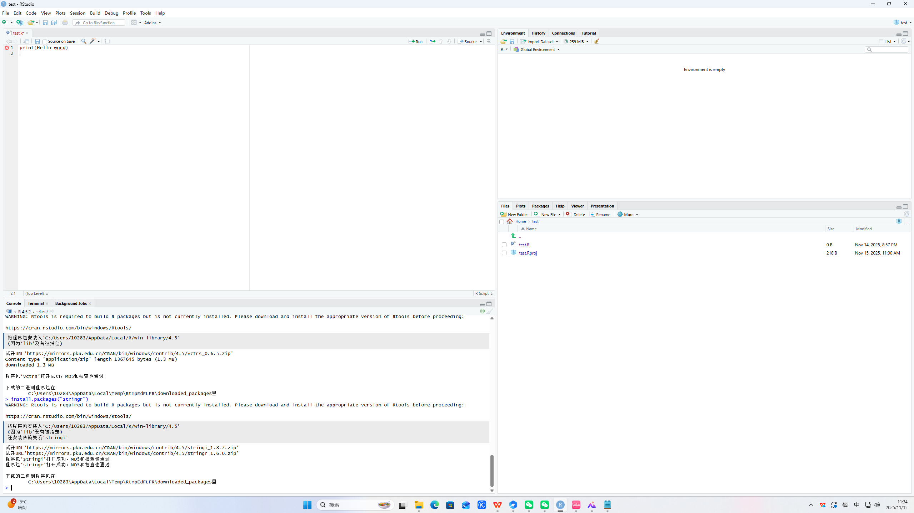
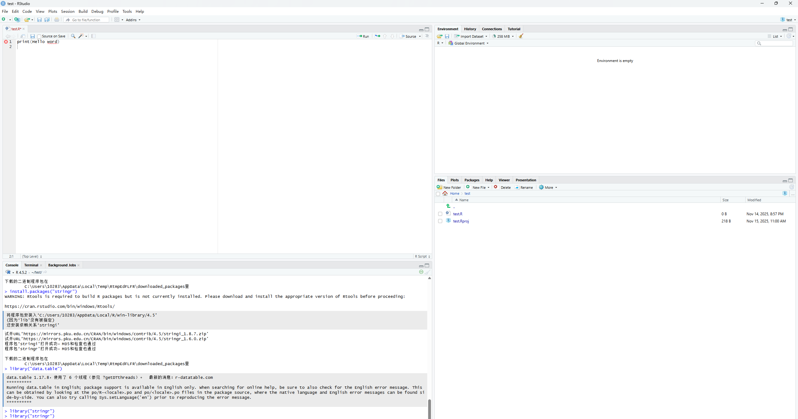
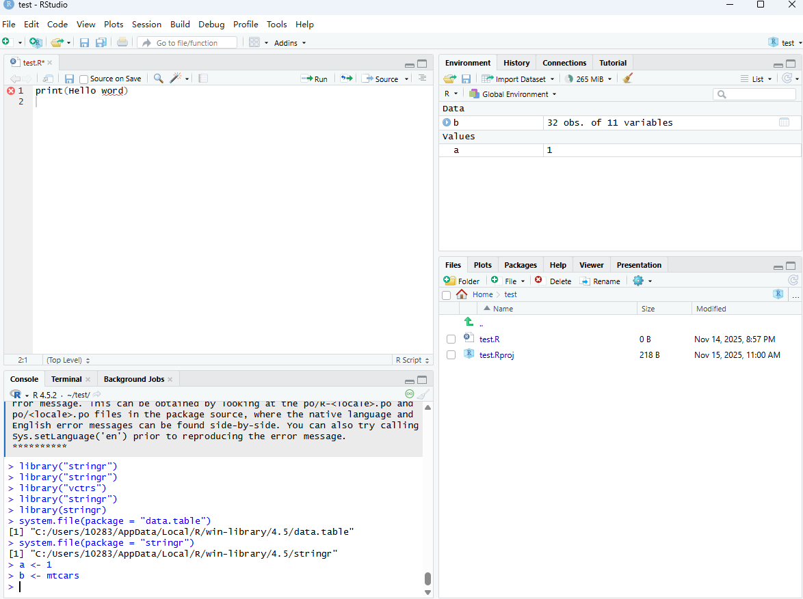
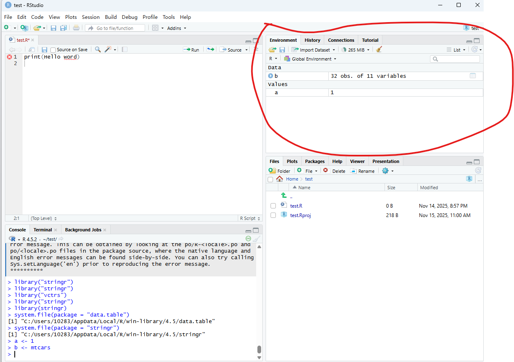

1.选择代码，按下 Ctrl + Enter 键或使用 Source 窗口标题栏上的 Run 按钮

2\.

3.在Rstudio控制台使用install.packages()函数可以下载安装包

4.使用library()函数可以导入安装包

5.经过安装后，下次不需要再次安装安装包。但是仍要重新导入安装包

6.赋值的符号为“=”快捷键则是"Alt" + "-"

7\.

8.先输入一个#在其后方输入文字即可进行注释操作。快捷键则为 Shift + Ctrl + C
